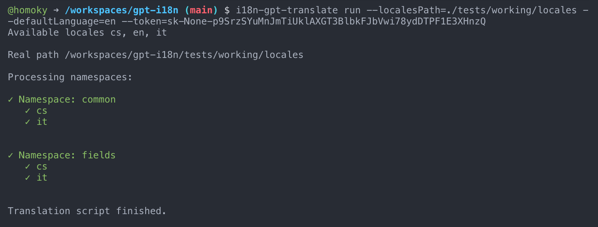

# i18n-gpt-translate

A CLI tool for translating internationalization (i18n) files using GPT models.

Run with `i18n-gpt-translate`.



## Features

- Automatically translates missing keys and and also it translate values, where value is empty (`""`).
- You do not need to specify what languages do you have, script will automatically detect it.

### Options

- `--localesPath` (required) - path to folder, where your locales folders (en, fr, it, etc.) exists.
- `--defaultLanguage` (required) - default language, that will be used as source for translation. This has to be one of the folders of `--localesPath`.
- `--token` (required) - ChatGPT token, that you can generate [here](https://platform.openai.com/settings/profile?tab=api-keys).

### Example Usage

```
i18n-gpt-translate run --localesPath=./tests/working/locales --defaultLanguage=en --token=YOUR_TOKEN_HERE
```

### Demo

### Before running script

```
# /locales/en/common.json
{
  "AccountsCommandPalette": {
    "inputPlaceholder": "Account name...",
    "noResults": {
      "title": "No results found"
    }
  },
  "AccountSetting": {
    "enableDeviceSosImporter": {
      "card": {
        "description": "This setting affects whether devices available on platform will be automatically registered in this CMS.",
        "title": "Setting up automatic device importing"
      }
    }
  }
}
```

```
# /locales/cs/common.json
{
  "AccountsCommandPalette": {
    // 👉 missing key inputPlaceholder with translation
    "noResults": {
      "title": "Nebyly nalezeny žádné výsledky"
    }
  },
  "AccountSetting": {
    "enableDeviceSosImporter": {
      "card": {
        "description": "", // 👈 translation is missing, value is empty
        "title": "Nastavení automatického importu zařízení"
      }
    }
  }
}
```

### After running script

```
# /locales/cs/common.json
{
  "AccountsCommandPalette": {
    "inputPlaceholder": "Název účtu...", 👈
    "noResults": {
      "title": "Nebyly nalezeny žádné výsledky"
    }
  },
  "AccountSetting": {
    "enableDeviceSosImporter": {
      "card": {
        "description": "Toto nastavení ovlivňuje, zda zařízení dostupná na platformě budou automaticky registrována v tomto CMS.", 👈
        "title": "Nastavení automatického importu zařízení"
      }
    }
  }
}
```
